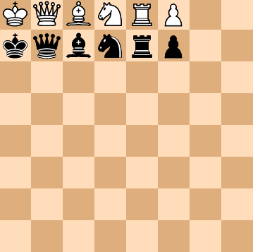
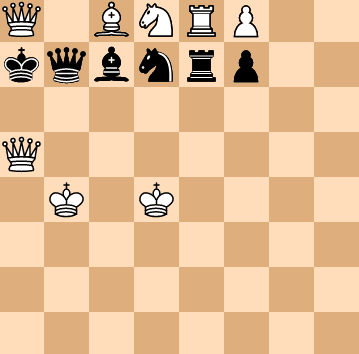

# chess_portfolio - 22.05.15 ~

## Used languages & tools

1. Front
    - HTML
    - CSS
    - SVG
    - JavaScript
    - D3.js
    - React
    - Redux
2. Back
    - JavaScript
    - Node.js
    - Express
    - Nginx
3. Eviroment
    - Centos OS(WSL2)

## Making Components of Chess

1. ~~ChessBoard~~
    - [x] cells
    - [x] colors of cells

2. ~~ChessPieaces~~
    - [x] white king
    - [x] black king
    - [x] white queen
    - [x] black queen
    - [x] white pawn
    - [x] white pawn
    - [x] white rook
    - [x] black rook
    - [x] white bishop
    - [x] black bishop
    - [x] white knight
    - [x] black knight (22.05.15)

    

  
3. Effects
    - [x] animation when a pieace move
    - [x] background color of a cell a selected pieace have
    - [x] a effect of a checked cell
    - [x] backgorund color of a previous cell a piece left
    - [x] backgorund color of a current cell a piece reachs
    - [x] circles on cells a selected pieace can move

    

4. Events
    - [ ] mouse over and out a cell
    - [ ] select a cell
    - [ ] click another cell with a pieace

## Chess Logic

    - 

## Making a Front Page

    - Login Page
    - Profile Page
    - Admin Page

