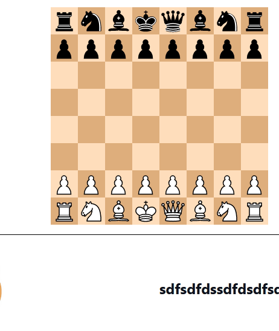
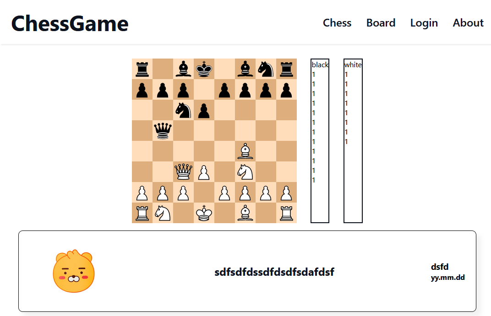
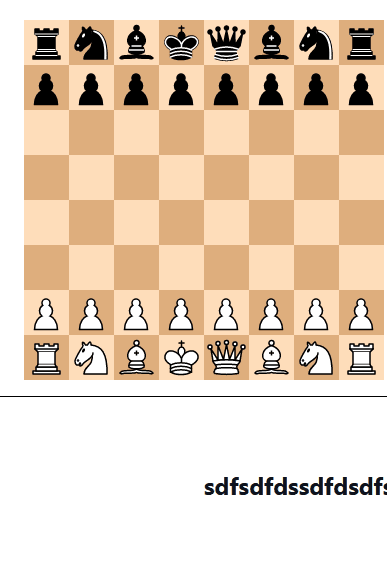

# chess_portfolio - 22.05.15 ~

## Used languages & tools

1. Front
   - HTML
   - CSS
   - SVG
   - JavaScript
   - D3.js
   - React
   - Redux
2. Back
   - JavaScript
   - Node.js
   - Express
   - Nginx
3. Eviroment
   - Centos OS(WSL2)

## Making Components of Chess

1. ~~ChessBoard~~

   - [x] cells
   - [x] colors of cells

2. ~~ChessPieaces~~

   - [x] white king
   - [x] black king
   - [x] white queen
   - [x] black queen
   - [x] white pawn
   - [x] white pawn
   - [x] white rook
   - [x] black rook
   - [x] white bishop
   - [x] black bishop
   - [x] white knight
   - [x] black knight (22.05.15)

   

3. ~~Effects~~

   - [x] animation when a pieace move
   - [x] background color of a cell a selected pieace have
   - [x] a effect of a checked cell
   - [x] backgorund color of a previous cell a piece left
   - [x] backgorund color of a current cell a piece reachs
   - [x] circles on cells a selected pieace can move

   

4. ~~Events~~

   - [x] mouse over and out a cell
   - [x] select a cell
   - [x] click another cell with a pieace (22.05.26)

   

## Making a Front Page

1. Making Components of Pages

   - [x] NavBar
   - [x] Chess
   - [] ReadingPage
   - [] WritingPage
   - [x] BoardCard (2022.05.24)
   - [] Login&SingUpFrom

2. Making Pages

   - Chess Page [x] (2022.05.23)
   - Board Page
   - Login Page
   - Profile Page
   - About

   

## Chess Logic

### ~~상대방 말 공격~~

      1. 이동 가능한 범위에 있는 상대방의 말이 있는지 피스의 색을 통하여 확인한다.
      2. 공격범위에 왕이 있다면 체스를 선언하고 빨간색으로 바꾼다.
      3. 이동 가능한 범위에 상대방의 말이 있다면 클릭가능하게 한다.
      4. 상대의 말을 클릭하면 피스의 배경과 선택 가능한 상태를 바꾸고 이동시킨다.
      5. 공격당한 상대의 말의 배경색을 원상태로 바꾸고 옆으로 이동시켜 보드에서 사라지게한다.
      6. 이동 전 셀의 상태를 비우고, 이동 후 셀의 상태를 현재의 피스로 바꾼다.
      7. 현재셀에서 이동가능한 셀과 공격가능한 피스를 계산한다.[x] (2022.05.26)
      8. 턴을 바꾼다.

### 승리 혹은 패배조건

      1. 왕이 상대방의 말로 하여금 더 이상 이동할수없다면 승리와 패배를 선언한다.

### 앙파상

      1. 앙파상을 하기 위한 폰은 반드시 5번째 행에 위치해 있어야 합니다.
      2. 앙파상으로 잡히는 폰은 반드시 이전 수에 앞으로 두 칸 전진했어야 합니다.
      3. 앙파상은 상대의 폰이 두 칸 전진한 바로 그다음 수에만 할 수 있습니다. 만약 앙파상을 하지 않으면 그 기회를 잃게 됩니다.

## 캐슬링

## Pages
